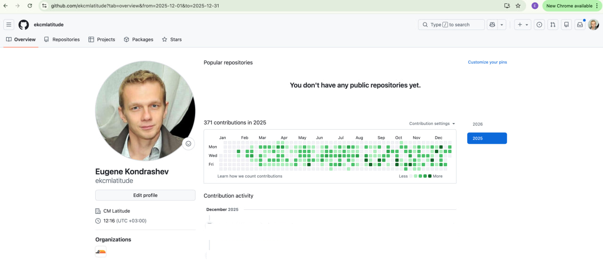
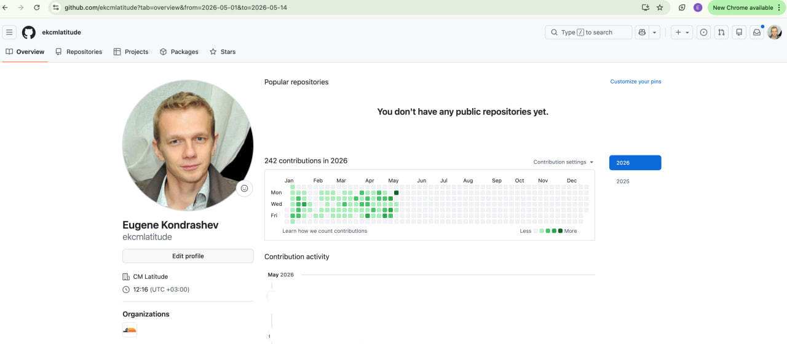

# Hawkeye Contributions — Eugene Kondrashev

This repository is a public reference for my engineering activity on the
[Hawkeye](https://neubird.ai) data integration layer at
[Neubird.ai](https://neubird.ai) (Jan 2025 – May 2026, Senior Go Engineer
contract). It contains no code — code lives in customer-owned private
repositories. This repo exists so reviewers of my CV can verify the activity
described.

## Where the actual work lives

All my Hawkeye commits, PRs, and reviews are on the customer-provided GitHub
account: **[github.com/ekcmlatitude](https://github.com/ekcmlatitude)**

That account is the source of truth for activity volume and cadence on this
contract.

## Contribution activity

*Full-year 2025 — 371 contributions.*

*2026 through 2026-05-14 — 242 contributions.*

**At-a-glance metrics:**

- Authored 77k+ lines of Go and Python across 210+ merged PRs over 16 months
- Consistent weekday cadence across the full contract period
- 2025: 371 contributions · 2026 (Jan – May 14): 242 contributions

Verification via GitHub PR search:
- `is:pr is:merged author:ekcmlatitude merged:2025-01-01..2026-05-15`

## What I worked on

Hawkeye is Neubird's
[agentic AI SRE for enterprise incident resolution](https://neubird.ai). My
work was on its **data integration layer** — a Postgres-based service that
exposes 40+ observability and ITSM SaaS platforms (Datadog, Splunk, New Relic,
Dynatrace, AWS CloudWatch, Azure Monitor, Azure Prometheus, Grafana, IBM
Cloud, PagerDuty, FireHydrant, ServiceNow, and many others) as queryable
Postgres tables. SQL queries are translated into each vendor's native query
language (NRQL, KQL, TraceQL, PromQL, Splunk SPL, CloudWatch Insights,
Datadog filters, Dynatrace DQL/USQL) so Hawkeye's reasoning chain
(a fine-tuned Llama 3.2 70B per Neubird's
[public materials](https://neubird.ai)) can investigate incidents in plain
SQL across heterogeneous telemetry.

My role:

- Primary contributor on the Go codebase, owning vendor integration plugins
  across major observability and ITSM platforms.
- New plugin development for several vendors, plus extending existing
  plugins with SQL-feature pushdown: aggregations, GROUP BY, ORDER BY,
  regex filters, OR/AND/NOT pushdown, multi-aggregation, cursor pagination.
- Owned nightly-build triage end-to-end — run-to-run failure diffing,
  categorisation, root-cause deep-dives, ticket creation.
- Improved CI determinism via gated reproduction tests for timing-sensitive
  flakes (15–20 intermittent failures turned reproducible across the
  contract).
- Customer-facing data-quality issue triage on live deployments.

## LLM-augmented development

Through the contract I built and operated an LLM-augmented development
workflow on the same codebase using Claude Code. Core techniques:

- **Task-pattern context engineering** — for each common task type, a
  context bundle (templates, prior evidence, vocabulary locks, workflow
  steps) is loaded automatically from a short user prompt. After execution,
  the agent updates the task's own assets so the next instance of the same
  task type starts smarter.
- **Four production task-types fully automated end-to-end:** prompt testing,
  bug fix (reproduction + Before evidence + TDD + After evidence), nightly
  failures analysis, new plugin development.
- **Prompt-quality critique** — agent proactively reviews user prompts and
  surfaces more efficient or correct approaches before execution.

Measured outcome: weekly merged-PR throughput increased ~1.8× post-integration
(5.1 vs 2.8 PRs/week across pre- and post-integration windows on the
ekcmlatitude profile).

## Reference / contact

- **LinkedIn:** [linkedin.com/in/eugene-kondrashev-64876922](https://www.linkedin.com/in/eugene-kondrashev-64876922)
- **Email:** eugene.kondrashev@gmail.com

© 2026 Eugene Kondrashev. Reference repository — content not for redistribution.

---

*Last updated: 2026-05-15*
